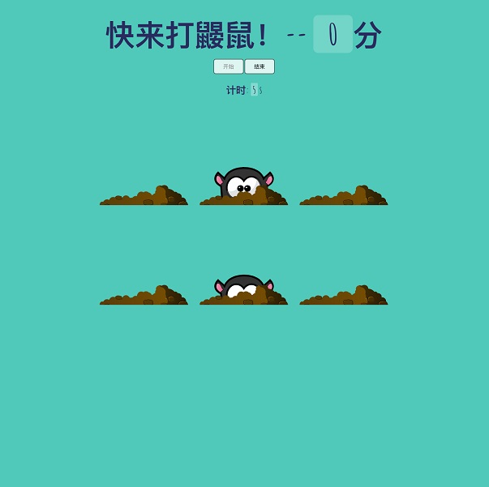

## 打鼹鼠小游戏

* 利用HTML、css3、es6实现的击打鼹鼠小游戏。
* 使用html5 audio元素添加声音特效。
* 使用flex布局，es6编写程序。
* 实现如下功能：
    * 开始游戏，结束游戏和击打鼹鼠时声音特效
    * 统计分数
    * 计算时间

### 项目截图

   

### 在线预览

   [在线demo](http://sunyuqing.coding.me/beat-a-mole)
